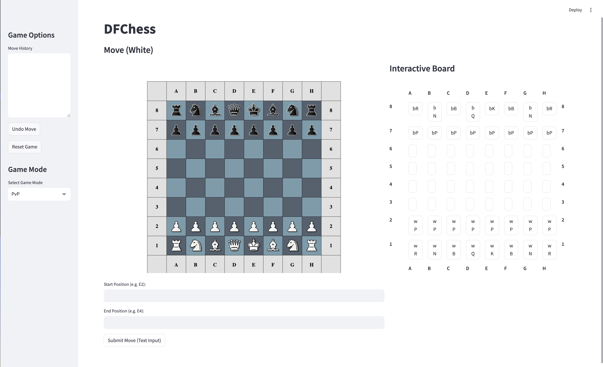
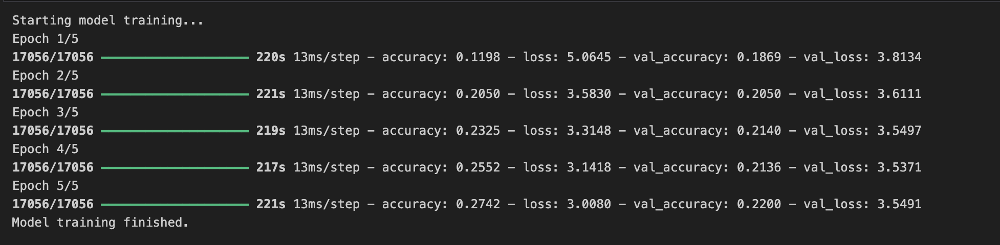

# DFChess

**Author**: Eric Chi  
**Email**: ericchi@g.ucla.edu

#### A full chess game engine developed using only pandas dataframes to demonstrate data manipulation and analaysis. The AI opponent was trained using tensorflow.

#### Input can be submitted through the Interactive Board (select piece to move followed by position to move to) or using Chess notation in the textboxes.
To run: 
- % -pip install -r requirements.txt
- % streamlit run app.py

#### the model for the AI opponent was trained using a lichess dataset
The results of the initial training of the model was

I only used 5 epochs but the training set was extremely large. Wanted to rush into implementation before training a better model so the AI opponent is quite easily beatable for anyone with basic chess knowledge.

To switch to Singleplayer mode, use the Game Mode radio and switch to PVAi and choose a color to play as. 